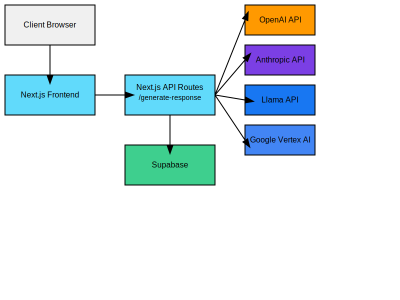

# AI Starter Stack

## AI Starter Stack Technology Tutorial
Owner: Stephen Wise
Date: August 15, 2024


This project is an AI Chat Application built with Next.js, React, and integrated with OpenAI's GPT models through API calls.

## Table of Contents
1. [Features](#features)
2. [Architecture](#architecture)
3. [Tech Stack](#tech-stack)
4. [Prerequisites](#prerequisites)
5. [Installation](#installation)
6. [Configuration](#configuration)
7. [Usage](#usage)
8. [API Reference](#api-reference)
9. [Database Schema](#database-schema)
10. [Deployment](#deployment)
11. [Project Structure](#project-structure)
12. [File Structure](#file-structure)
13. [Styling](#styling)
14. [Error Handling and Loading States](#error-handling-and-loading-states)
15. [Components](#components)
16. [Additional Pages](#additional-pages)
17. [Performance Optimizations](#performance-optimizations)
18. [Browser Compatibility](#browser-compatibility)
19. [Troubleshooting](#troubleshooting)
20. [FAQ](#faq)
21. [Contributing](#contributing)
22. [License](#license)
23. [Acknowledgements](#acknowledgements)
24. [Contact Information](#contact-information)
25. [Issue Log](#issue-log)
26. [Changelog](#changelog)

## Features

- Chat interface for interacting with AI models
- Support for OpenAI GPT models:
  - GPT-3.5-turbo
  - GPT-4
- Message history stored in Supabase
- Responsive design for mobile and desktop
- Dark mode support

## Architecture



This diagram illustrates the main components of the AI Starter Stack and their interactions:
- Client Browser: The user interface
- Next.js Frontend: React-based frontend
- Next.js API Routes: Backend API handling AI model interactions
- Supabase: Database for storing chat messages
- AI Service: OpenAI API

## Tech Stack

- Frontend: Next.js, React
- Backend: Next.js API Routes
- Database: Supabase
- AI Integration: OpenAI
- Styling: Tailwind CSS
- State Management: React Hooks
- Deployment: Vercel

## Prerequisites

- Node.js (v14 or later)
- npm or yarn
- Supabase account
- OpenAI API key

## Installation

1. Clone the repository:
   ```
   git clone https://github.com/wordopera/my-ai-app.git
   cd my-ai-app
   ```

2. Install dependencies:
   ```
   npm install
   ```

## Configuration

1. Copy `.env.example` to `.env.local`:
   ```
   cp .env.example .env.local
   ```

2. Update the `.env.local` file with your API keys and configuration:
   ```
   NEXT_PUBLIC_SUPABASE_URL=your_supabase_url
   NEXT_PUBLIC_SUPABASE_ANON_KEY=your_supabase_anon_key
   SUPABASE_SERVICE_ROLE_KEY=your_supabase_service_role_key
   OPENAI_API_KEY=your_openai_api_key
   ```

## Usage

1. Start the development server:
   ```
   npm run dev
   ```

2. Open [http://localhost:3000](http://localhost:3000) in your browser.

3. Select an AI model (GPT-3.5-turbo or GPT-4) from the dropdown menu.

4. Type your message in the input field and click "Send" or press Enter.

5. View the AI's response in the chat window.

6. The interface is responsive and adapts to both mobile and desktop screen sizes.

7. Toggle between light and dark mode using the system preference or the provided toggle switch.

## File Structure

```
my-ai-app/
├── .git/
├── .next/
├── app/
│   ├── api/
│   │   └── generate-response/
│   │       └── route.ts
│   ├── components/
│   │   ├── ChatBubble.tsx
│   │   ├── Footer.tsx
│   │   ├── Header.tsx
│   │   ├── LoadingIndicator.tsx
│   │   └── ModelSelector.tsx
│   ├── hooks/
│   │   └── useDarkMode.ts
│   ├── favicon.ico
│   ├── globals.css
│   ├── layout.tsx
│   └── page.tsx
├── node_modules/
├── public/
│   ├── logo.png
│   ├── og-image.png
│   └── twitter-image.png
├── .env.example
├── .env.local
├── .eslintrc.json
├── .gitignore
├── next-env.d.ts
├── next.config.js
├── package-lock.json
├── package.json
├── postcss.config.js
├── README.md
├── tailwind.config.ts
└── tsconfig.json
```

## Styling

The project uses Tailwind CSS for styling. The configuration can be found in `tailwind.config.ts`. Custom styles and component classes are defined in `app/globals.css`.

Key features of the styling:
- Responsive design using Tailwind's utility classes
- Custom color scheme with primary, secondary, and neutral colors
- Dark mode support
- Custom component classes for buttons, inputs, and other UI elements

## Error Handling and Loading States

The application implements robust error handling and loading states:

- API errors are caught and displayed to the user with toast notifications
- Loading indicators are shown during API calls
- Input fields and buttons are disabled during loading states
- Error messages are displayed in the chat interface when applicable

## API Reference

The main API endpoint for generating AI responses is:

```
POST /api/generate-response
```

Request body:
```json
{
  "message": "Your message here",
  "model": "gpt-3.5-turbo"
}
```

Response:
- Status 200: Streaming response with AI-generated text
- Status 400: Bad request (missing message or model)
- Status 500: Server error

The API implements streaming responses, allowing for real-time display of AI-generated text as it's being produced.

## Components

The application includes several reusable components:

- `ChatBubble`: Renders individual chat messages
- `LoadingIndicator`: Displays a loading spinner during API calls
- `ModelSelector`: Allows users to select the AI model
- `Header`: Displays the application header with logo and title
- `Footer`: Renders the page footer with links and copyright information

## Additional Pages

The application includes the following additional pages:

- Terms of Use (`/terms-of-use`): Outlines the terms and conditions for using the application
- Privacy Policy (`/privacy-policy`): Details the application's data handling and privacy practices

These pages are accessible via links in the Footer component.

## Performance Optimizations

The application implements several performance optimizations:

- Server-side rendering with Next.js for improved initial load times
- Code splitting and lazy loading of components
- Efficient state management using React Hooks
- Optimized API calls with debouncing and caching where appropriate
- Minimized and compressed assets for production builds

## Browser Compatibility

The application is designed to be compatible with modern web browsers, including:

- Chrome (latest 2 versions)
- Firefox (latest 2 versions)
- Safari (latest 2 versions)
- Edge (latest 2 versions)

Mobile browsers are also supported, with a responsive design that adapts to different screen sizes.

## Troubleshooting

Common issues and solutions:

1. API Key Issues:
   - Ensure that your OpenAI API key is correctly set in the `.env.local` file
   - Check that you have sufficient credits in your OpenAI account

2. Supabase Connection Errors:
   - Verify that your Supabase URL and anon key are correct in the `.env.local` file
   - Ensure that your Supabase project is active and the database is accessible

3. Build Errors:
   - Run `npm install` to ensure all dependencies are up to date
   - Clear the `.next` folder and rebuild the project

If you encounter any other issues, please check the GitHub Issues page or contact the development team.

## FAQ

Q: How do I change the available AI models?
A: Edit the `models` array in `app/page.tsx` to add or remove models.

Q: Can I use this application with other AI providers?
A: Currently, the application is set up to work with OpenAI. To integrate other providers, you would need to modify the API route and add the necessary authentication and API calls.

Q: How can I contribute to the project?
A: Please see the Contributing section below for guidelines on how to contribute.

## Contributing

We welcome contributions to the AI Starter Stack project! Here are some guidelines to follow:

1. Fork the repository and create your branch from `main`.
2. If you've added code that should be tested, add tests.
3. Ensure your code lints and follows the project's coding style.
4. Issue that pull request!

### Coding Style Guidelines

- Use TypeScript for all new code
- Follow the [Airbnb JavaScript Style Guide](https://github.com/airbnb/javascript)
- Use functional components and hooks for React code
- Write meaningful commit messages following the [Conventional Commits](https://www.conventionalcommits.org/) specification

## License

This project is licensed under the ISC License.

## Acknowledgements

- Next.js
- React
- Tailwind CSS
- Supabase
- OpenAI

## Contact Information

For questions or feedback, please contact Stephen Wise at [contact email].

## Issue Log

| Date       | Issue                                          | Status  |
|------------|------------------------------------------------|---------|
| Aug 8, 2024 | LiteLLM routing to multiple LLM's not working | On-hold |
| Aug 15, 2024| Device responsive design needed               | On-hold |

## Changelog

### Version 0.2.0 (August 15, 2024)
- Added support for GPT-4
- Improved responsive design for mobile devices
- Added Terms of Use and Privacy Policy pages
- Implemented streaming responses for faster AI output
- Various bug fixes and performance improvements

### Version 0.1.0 (July 15, 2024)
- Initial release with support for GPT-3.5-turbo
- Basic chat interface and Supabase integration

---
Internal, Confidential
Stephen Wise, August 15, 2024
